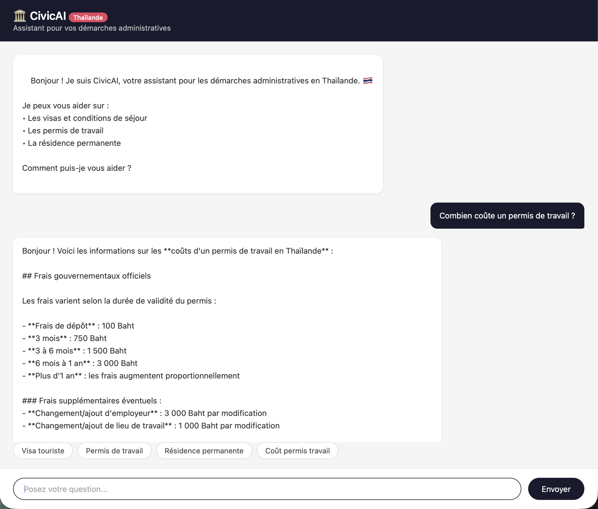

# 🏛️ CivicAI — Thailand Administrative Assistant

Conversational assistant built on Claude (Anthropic) to help French expats navigate administrative procedures in Thailand. Multilingual hybrid RAG (French queries → French/Thai administrative docs) with a cross-encoder reranker and an empirically-tuned web-search fallback.

## Demo



---

## Tech Stack

| Layer | Technology |
|---|---|
| LLM | Claude Sonnet 4.5 (Anthropic) |
| Agent | LangGraph |
| Embeddings | **BAAI/bge-m3** (multilingual, 100+ languages, 1024-dim, local via sentence-transformers) |
| Reranker | **BAAI/bge-reranker-v2-m3** (cross-encoder, sigmoid-normalized scores, local) |
| Vector store | ChromaDB (cosine space) |
| Web search | Tavily API (fallback only) |
| Evaluation | **RAGAS** (Claude judge + bge-m3 embeddings, no OpenAI dependency) |
| Backend | FastAPI + Uvicorn |
| Frontend | Vanilla HTML/CSS/JS |
| Containerization | Docker + Docker Compose — **2.09 GB image** (CPU-only torch, bundled CUDA stripped → −76% vs default) |

---

## Architecture

```
Browser (web interface)
        ↓ POST /chat
FastAPI app                  (src/civicai/api/)
        ↓
LangGraph agent              (src/civicai/agent/)
        ├── search_docs   →  retrieve (top_k=40, dense, bge-m3)
        │                 →  rerank   (top_n=8, bge-reranker-v2-m3, sigmoid)
        │                 →  route    (top reranked score < 0.67 → web_search)
        └── web_search    →  Tavily
```

Every magic value (model name, threshold, top_k/top_n, chunk size, paths, collection name) lives in [`src/civicai/config.py`](src/civicai/config.py) — nothing is hardcoded elsewhere.

### Routing Logic

1. `search_docs` always runs first — dense recall (top 40) → cross-encoder rerank (top 8).
2. If the **top reranked sigmoid score < 0.67** → fall back to `web_search`. **0.67 is the value selected by the P3c RAGAS sweep** over the 73-item French evaluation set, optimized to drive ungrounded-local answers to zero.
3. Conversation history is maintained client-side and sent with each request.

---

## Features

- **Multilingual hybrid RAG** — bge-m3 matches French queries against French/Thai administrative docs out of the box.
- **Cross-encoder reranker** — bge-reranker-v2-m3 fixes dense-retrieval ranking errors; scores are sigmoid-normalized so the routing threshold is interpretable in [0, 1] across queries.
- **Empirically-tuned routing threshold** — chosen via a RAGAS-driven sweep, not by intuition.
- **Confidence-aware fallback** — automatic web search when the corpus doesn't cover the question.
- **Conversation history** — Claude remembers prior turns.
- **Web interface** — chat with question suggestions.
- **Containerized** — multi-stage Dockerfile (2.09 GB, CPU-only torch) + HF model cache volume; runs locally with `docker compose up`.

---

## Local Installation

### Prerequisites

- Python 3.12+
- [uv](https://docs.astral.sh/uv/) — package manager
- API keys: [Anthropic](https://console.anthropic.com) + [Tavily](https://tavily.com)
- ~3 GB free disk for the bge-m3 + reranker model weights (downloaded on first use)

### Setup

```bash
git clone https://github.com/AlexMo-1205/civicai-v2.git
cd civicai-v2

# Install dependencies
uv sync

# Configure environment variables
cp .env.example .env
# Edit .env with your API keys

# Generate the vector database (downloads bge-m3 the first time, ~2 GB)
uv run python scripts/ingest.py
# (equivalent to `uv run civicai-ingest`)

# Start the server (downloads the reranker the first time, ~1 GB)
uv run uvicorn civicai.api.app:app --reload
```

Open [http://localhost:8000](http://localhost:8000)

---

## Run in Docker

```bash
# Build and start
docker compose up --build

# Stop
docker compose down
```

The app is accessible at [http://localhost:8000](http://localhost:8000).

**Image size: 2.09 GB.** Down from 8.66 GB by routing `torch` through PyTorch's CPU wheel index (`[tool.uv.sources]` in `pyproject.toml`) — the default `torch` wheel ships ~5 GB of bundled CUDA runtime that this project never uses (bge-m3 and the reranker run on CPU). Stripping it gave **−76%** with no behavior change.

Two persistent volumes (declared in `docker-compose.yml`):

- `./chroma_db` → `/app/chroma_db` — vector store, regenerated only if `docs/` changes.
- `./.hf_cache` → `/root/.cache/huggingface` — bge-m3 + reranker weights (~3 GB total) downloaded once on first start, reused across restarts (cold start ~5 min, restart ~22 s).

---

## Project Structure

```
civicai-v2/
├── src/civicai/
│   ├── config.py            # Single source for every constant
│   ├── llm/client.py        # Anthropic client (lazy singleton)
│   ├── rag/
│   │   ├── embeddings.py    # EmbeddingProvider Protocol + bge-m3 adapter
│   │   ├── vectorstore.py   # ChromaDB client (cosine space)
│   │   ├── retrieval.py     # Candidate dataclass + dense retrieve()
│   │   ├── reranker.py      # Reranker Protocol + bge cross-encoder adapter
│   │   └── ingest.py        # Chunking (with small-doc guard) + embed + store
│   ├── tools/
│   │   ├── definitions.py   # Anthropic tool schemas
│   │   ├── search_docs.py   # retrieve → rerank → route
│   │   ├── web_search.py    # Tavily wrapper
│   │   └── dispatcher.py    # name → handler map
│   ├── agent/
│   │   ├── state.py         # AgentState TypedDict
│   │   ├── nodes.py         # call_claude, run_tools, should_continue
│   │   └── graph.py         # build_graph + ask()
│   └── api/
│       ├── app.py           # create_app() factory
│       ├── routes.py        # /, /chat, /health
│       └── schemas.py       # Pydantic models
├── scripts/ingest.py        # CLI shim → civicai.rag.ingest
├── evals/                   # RAGAS evaluation harness (P3b runner, scorer, P3c sweep)
│   ├── dataset.jsonl        # 73-item French evaluation set
│   ├── runner.py            # Full pipeline + RAGAS scoring (pipeline phase)
│   ├── scorer.py            # Standalone scorer (no civicai.rag imports)
│   ├── sweep.py             # Pure-data threshold sweep (zero LLM calls)
│   └── runs/                # Generated reports + per-item JSONL caches (gitignored)
├── tests/                   # Mocked pytest suite (no real API calls)
├── docs/                    # Administrative knowledge base (.txt)
├── static/index.html        # Vanilla JS chat UI
├── Dockerfile               # Multi-stage build (+ HF cache volume)
├── docker-compose.yml
├── pyproject.toml           # hatch wheel target src/civicai
└── .env.example
```

### Running the test suite

```bash
uv run pytest
```

The suite uses mocks for Anthropic, Tavily, ChromaDB, and the embedding model — it runs in seconds and never makes a network call.

---

## Evaluation

The evaluation harness in `evals/` measures retrieval+generation quality with [RAGAS](https://docs.ragas.io/) (Claude as judge LLM, bge-m3 for embedding-based metrics — no OpenAI default).

### Dataset

`evals/dataset.jsonl` — **73 items, all in French**, the language users actually query in:

| Category | n | Purpose |
|---|---|---|
| `local` | 58 | Answerable from the KB; measures retrieval + generation quality |
| `fallback` | 11 | Near-boundary questions the KB lacks; measures the web-search routing decision |
| `adversarial` | 4 | False-premise questions the agent must correct (reported separately) |

### Headline scores (`local` category, n=58)

| Metric | Mean | Median |
|---|---|---|
| faithfulness | **0.728** | 0.769 |
| answer_relevancy | **0.851** † | 0.866 |
| context_precision | **0.911** | 1.000 |
| context_recall | **0.968** | 1.000 |

† Note the **RAGAS `answer_relevancy` blind spot** described in *Known limitations* below — individual items that openly disclose missing info can score near 0 even when the answer is plainly relevant; this is a metric artifact, not a quality drop.

> **Caveat — measurement timing.** The headline above was scored *before* the
> P4 anti-hallucination prompt hardening. The hardening itself was validated
> on a targeted 10-item before/after set (see
> `evals/runs/p4_validation_results.jsonl` and `evals/p4_validate.py`), not by
> re-running the full 73-item eval. The substantive change — the tax-bracket
> fabrication is gone, retrieval-side metrics unchanged — is real; the
> aggregate would shift by single-digit-percent noise.

### Routing accuracy at the selected threshold (T = 0.67)

| | |
|---|---|
| Routing accuracy | **87.0%** (60/69 local+fallback items) |
| Local items wrongly routed to web (low-harm) | 9 |
| Fallback items wrongly kept local (high-harm) | **0** |

### Running the evals

```bash
# Phase 1 — pipeline pass: runs the full agent once per dataset item,
#                          freezes records to evals/runs/p3b_records.jsonl
uv run python evals/runner.py --no-score

# Phase 2 — RAGAS scoring (standalone, no civicai.rag imports):
#           appends per-item scores to evals/runs/p3b_results.jsonl
uv run python evals/scorer.py

# Phase 3 — threshold sweep (zero LLM calls, pure data):
#           rebuilds the recommendation from the cached scores
uv run python evals/sweep.py            # report only
uv run python evals/sweep.py --apply    # also writes the value into config.py
```

Both run files are append-flushed and resumable: a kill or rate-limit keeps everything done so far. See the generated `evals/runs/p3b_report_*.md` and `evals/runs/p3c_sweep_report_*.md`.

---

## Known limitations & ceiling

The evaluation harness exposed three operating limits, all of which are characterized — not hidden.

- **Routing accuracy caps around 90%** because the reranker scores **single-chunk relevance**. Several multi-doc `local` questions (answer spread across 2–4 docs) share a top-1 reranker score band (0.50–0.57) with the `fallback` near-misses, so no scalar threshold separates them. Surpassing this requires a dedicated **answerability classifier** on the top reranked chunk, or fine-tuning the reranker on a `(query, chunk → answer-present)` signal — both out of scope for this iteration.

- **Threshold T = 0.67 was chosen to drive high-harm errors (ungrounded local answers) to zero**, trading ~3 points of raw accuracy for safety. At T=0.67 the sweep reports `fallback→local = 0` and `local→web = 9`; the 9 re-routed locals are low-harm (web still produces a correct answer, or the multi-doc local answer exists but the reranker can't see across docs). The full sweep is in `evals/runs/p3c_sweep_report_*.md`.

- **The eval caught a generation-side hallucination, the prompt patched it, the patch was validated.** On a tax-rapatriement multi-doc question the model fabricated a full progressive PIT bracket table absent from the corpus (faithfulness 0.068). RAGAS flagged it correctly. Fix: added a "Règle d'ancrage CRITIQUE" block to the system prompt — never state a figure, fee, rate, percentage, deadline or date not present in retrieved context; never fill from prior knowledge; if a specific figure is missing, say so plainly instead of inventing one. Validated on a targeted 10-item before/after set (2 hallucination cases + 6 high-faithfulness locals as a regression check + 2 adversarials): the fabricated bracket table is gone, the high-faith locals stayed within noise, the adversarials still correctly contradict their false premise. Detect → fix → revalidate, the harness doing its job.

- **RAGAS `answer_relevancy` blind spot — engineering judgment over score-chasing.** The same anti-hallucination prompt makes the model say things like "ce détail précis n'est pas dans ma base" when a specific figure isn't retrievable. RAGAS's `answer_relevancy` metric uses a reverse-question step that misfires on those transparent gap-disclosures, producing scores near 0 on responses that are plainly relevant and correct (`tax-03` reproduces this: rel 0.000, faithfulness 0.875 on a substantively right answer). We **kept the transparent behavior** — an administrative assistant SHOULD tell users when a specific figure isn't in its sources — and documented the metric limitation, rather than degrading the product to chase the score. Optimize the product, not the metric.

---

## Adding Documents

1. Add your `.txt` files to `docs/`
2. Re-run the ingestion:

```bash
uv run python scripts/ingest.py
# or in Docker:
docker compose up --build
```

---

## Environment Variables

Create a `.env` file from `.env.example`:

```
ANTHROPIC_API_KEY=sk-ant-...
TAVILY_API_KEY=tvly-...
```

---

## Technical Choices

**Why LangGraph instead of LangChain?**
LangGraph models the agent as an explicit state graph — transitions are readable, debuggable, and extensible without modifying existing logic.

**Why ChromaDB?**
Local vector database, zero infrastructure. Perfect for an MVP — migratable to pgvector or Pinecone in production without changing the ingestion code.

**Why bge-m3 + bge-reranker-v2-m3?**
The user base queries in French; the corpus mixes French and Thai administrative content. bge-m3 is a strong multilingual dense encoder; bge-reranker-v2-m3 is its matched cross-encoder. Both run locally — no extra API keys, no per-request cost. Sigmoid normalization on the cross-encoder makes the routing threshold portable across queries.

**Why an empirical routing threshold?**
The original hand-picked 0.5 was a guess. A 73-item French eval set + RAGAS-driven sweep selected 0.67 — the operating point that drives ungrounded-local answers to zero. Routing is now a measured decision, not a feel.

**Why vanilla JS for the frontend?**
Zero dependencies, zero build step. The interface is simple and statically deployable.

---

## Roadmap

- [ ] Answerability classifier on top reranked chunk (raise the ~90% routing ceiling)
- [ ] PDF support in addition to txt files
- [ ] Response streaming (WebSockets)
- [ ] User authentication

---

## Author

**Alexis Monnier** — [@AlexMo-1205](https://github.com/AlexMo-1205)

ML/AI Engineer - Data Scientist | Bangkok, Thailand
